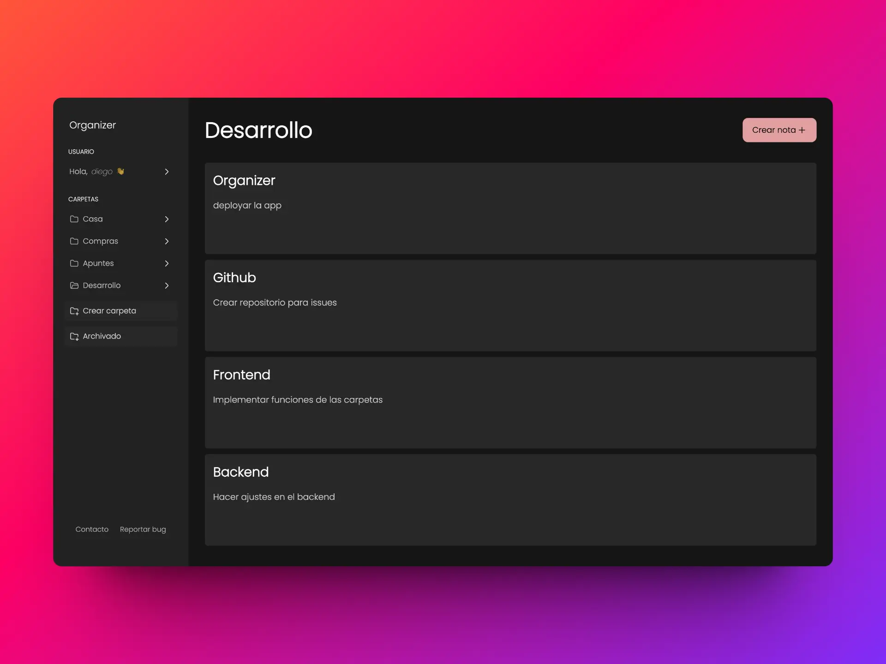

# Organizer

La mejor aplicación para organizarte.


Landing demo: [https://organizer-eta.vercel.app/](https://organizer-eta.vercel.app/)

## Características

- Autenticación basada en JWT.
- Implementación de Refresh Token.
- Encriptado de datos sensibles, garantizando la seguridad.
- Implementación de Guards, garantizando la seguridad y una mejor experiencia de usuario.
- Signals para la reactividad.
- Edición y validaciones de datos de usuario.
- Creación de carpetas y notas/tareas personalizables.
- Diseño responsive.
- Futuras actualizaciones.

## Requerimientos

- **Base de datos:** MySQL instalado.
- **Backend:** JDK 21+ y Spring Tools.
- **Frontend:** Angular 17 y Node.js 18+.

## ¿Cómo usar?

1. Crea una base de datos MySQL con el siguiente script:

   [Organizador Database Script](https://github.com/1auti/database-organizer/blob/main/organizer-database.sql)

2. Clona los repositorios de manera local:

   ```bash
   git clone https://github.com/1auti/organizer-backend.git 

   git clone https://github.com/diegoinost02/organizer-frontend.git 
Configuración Backend
Configura el usuario y contraseña de MySQL en el archivo application.properties.

properties
Copy code
spring.datasource.url=jdbc:mysql://localhost:3306/db_organizer
spring.datasource.username=root
spring.datasource.password=admin
IMPORTANTE: Si cambiaste el nombre de la base de datos, asegúrate de actualizar la URL en el archivo application.properties:
spring.datasource.url=jdbc:mysql://localhost:3306/database_name.

# Ejecución
## Backend
Ejecuta la aplicación en el puerto 8080 (por defecto en Spring).

## Frontend
Instala las dependencias y ejecuta la aplicación en el puerto 4200 (por defecto en Angular).

Copy code
npm install

Copy code
npm run start
# IMPORTANTE:
Si ejecutas el servidor del frontend en un puerto distinto, actualiza la configuración de CORS en el archivo SecurityConfig.java.
Si el backend está en otro puerto, cambia la API_URL en el archivo environments.ts.

Autor
@1auti



